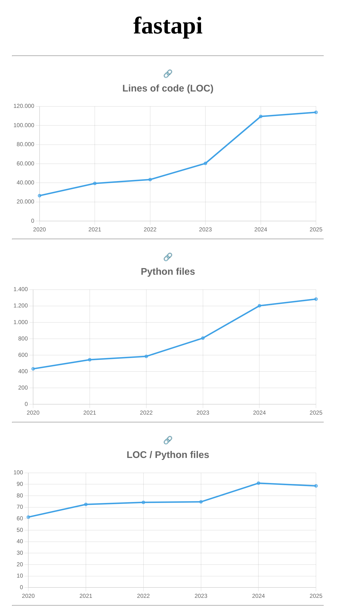

### Repositório selecionado:
https://github.com/fastapi/fastapi

### Gráfico selecionado: 

### Explicação:
Nota-se uma crescente na quantidade de linhas de codigo e de arquivos gerados, no entanto a proporção de linhas de codigo por arquivo se manteve pouco assentuada, partindo de patamares proximos de 60 para 90.

Essa evolução foi gradual e nota-se uma responsabilidade por parte dos desenvolvedores em não desbalancear essa proporção.

As curvas de boas praticas seguiram na mesma ideia proporção. A quantidade de arquivos e linhas de codigo seguiram na mesma linha.

A curva tem uma leve elevação depois de 2024, e isso se dá devido a demanda dos serviços oferecidos pela ferramenta.

O aumento das linhas de codigo no framework se da devido ao lançamento de 20 versões divididas ao longo do ano.
